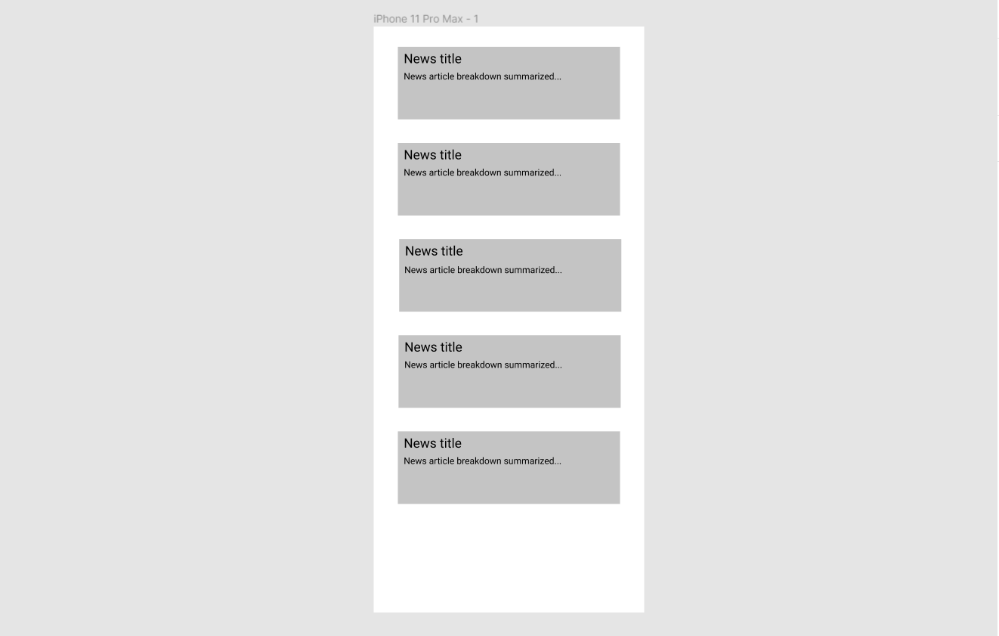

# News App

## Table of Contents
1. [Overview](#Overview)
1. [Product Spec](#Product-Spec)
1. [Wireframes](#Wireframes)
2. [Schema](#Schema)

## Overview
### Description
App showing current news and what's happening on the web.

### App Evaluation
- **Category: Simple news app. **
- **Mobile: Simple news app. **
- **Story: Allows readers to search through news. ** 
- **Market: Everyday news consumers. **
- **Habit: Morning news search. **
- **Scope: Everyday news consumers. **

## Product Spec

### 1. User Stories (Required and Optional)

**Required Must-have Stories**

* Show current news on the web as cell objects, filling cells using API call

**Optional Nice-to-have Stories**

* Save favorite news articles/events

### 2. Screen Archetypes

* List of cells that contain daily news from today related to our area
   * Each cell contains title of news that can direct us to the actual newspage 

### 3. Navigation

**Tab Navigation** (Tab to Screen)

* One tab containing the list view of cells

## Wireframes
[Add picture of your hand sketched wireframes in this section]

## Schema 
[This section will be completed in Unit 9]
### Models
[Add table of models]
### Networking
- Use an open news source to make an API call to and gather article information and links.
